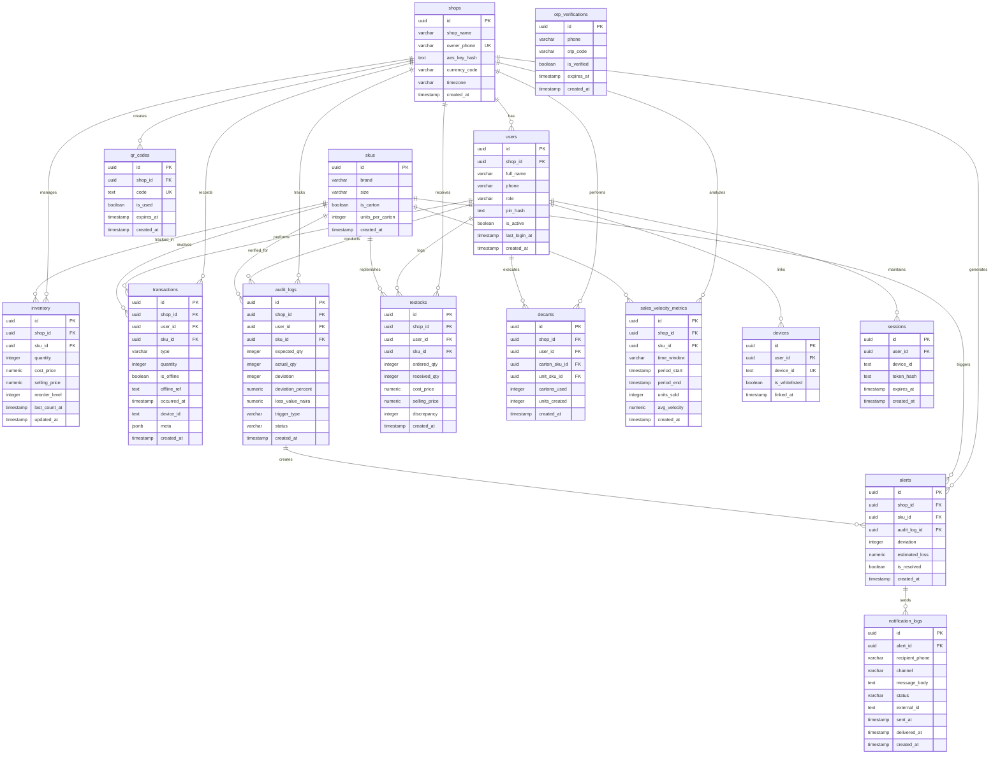

# Smart Loss Control - Database Schema

## Overview
This document provides a visual representation of the database schema for the Smart Loss Control system.

## Entity Relationship Diagram



## Table Descriptions

### Core Tables

#### shops
Stores shop/business information. Each shop has one owner and can have multiple staff members.

#### users
Stores both OWNER and STAFF user accounts. Linked to shops via `shop_id`.

#### devices
Tracks whitelisted devices for staff access control via QR code onboarding.

#### skus
Master product catalog for cooking oil brands (Mamador, King's, etc.) and sizes (1L, 2L, 5L, 25L).

#### inventory
Current stock levels for each SKU in each shop. Updated by sales, restocks, and decants.

### Transaction Tables

#### transactions
Immutable audit trail of all stock movements (SALE, RESTOCK, DECANT, AUDIT). Supports offline sync.

#### restocks
Records supplier deliveries with "Ordered vs Received" tracking to catch supplier errors.

#### decants
Tracks carton-to-unit conversions (e.g., 1 carton → 12 bottles).

### AI & Security Tables

#### audit_logs
Records AI-triggered spot checks comparing expected vs actual stock counts.

#### alerts
Auto-generated when deviation exceeds 10%. Triggers WhatsApp/SMS notifications.

#### sales_velocity_metrics
Tracks hourly/daily/weekly sales patterns for AI anomaly detection.

### Authentication & Security

#### otp_verifications
Temporary OTP codes for owner registration (4-digit codes).

#### sessions
JWT session management with 12-hour auto-logout.

#### qr_codes
One-time-use QR codes for secure staff device linking.

#### notification_logs
Tracks WhatsApp/SMS alert delivery status via Twilio.

## Key Relationships

1. **Shop → Users**: One-to-many (1 owner + multiple staff)
2. **Shop → Inventory**: One-to-many (each shop tracks its own stock)
3. **SKU → Inventory**: One-to-many (same product across multiple shops)
4. **Audit Log → Alert**: One-to-one (critical deviations auto-create alerts)
5. **Alert → Notifications**: One-to-many (alerts sent via multiple channels)

## Database Triggers

### Auto-Severity Calculation
```sql
-- Automatically calculates deviation_percent and sets status (OK/WARNING/CRITICAL)
CREATE TRIGGER trg_audit_severity
BEFORE INSERT ON audit_logs
FOR EACH ROW EXECUTE FUNCTION check_audit_severity();
```

### Auto-Alert Creation
```sql
-- Automatically creates alerts when deviation >= 10%
CREATE TRIGGER trg_create_alert
AFTER INSERT ON audit_logs
FOR EACH ROW EXECUTE FUNCTION create_alert_if_critical();
```

### Auto-Timestamp Update
```sql
-- Updates inventory.updated_at on every change
CREATE TRIGGER trg_inventory_updated_at
BEFORE UPDATE ON inventory
FOR EACH ROW EXECUTE FUNCTION update_inventory_timestamp();
```

## Indexes for Performance

### High-Frequency Query Indexes
- `idx_transactions_shop_id` - Fast shop transaction lookups
- `idx_transactions_occurred_at` - Time-based queries
- `idx_audit_logs_shop_sku` - Deviation tracking per SKU
- `idx_alerts_unresolved` - Quick access to open alerts
- `idx_sessions_expires_at` - Session cleanup queries

### Offline Sync Indexes
- `idx_transactions_type_occurred` - Sync by transaction type and time
- `unique(shop_id, offline_ref)` - Prevent duplicate offline sales

## Data Flow Examples

### Sale Flow
1. Staff logs sale → `transactions` (type: SALE, is_offline: true)
2. Offline data syncs → Updates `inventory.quantity`
3. AI checks velocity → May trigger spot check
4. Staff performs count → Creates `audit_logs` entry
5. If deviation > 10% → Auto-creates `alerts` entry
6. Alert triggers → Creates `notification_logs` entry

### Restock Flow
1. Owner logs delivery → `restocks` (ordered_qty vs received_qty)
2. System calculates discrepancy → Stored in `discrepancy` column
3. Updates `inventory` with received_qty only
4. Creates `transactions` entry (type: RESTOCK)

### Decant Flow
1. Staff breaks carton → `decants` (carton_sku_id → unit_sku_id)
2. Reduces carton inventory → Updates `inventory` for carton SKU
3. Increases unit inventory → Updates `inventory` for unit SKU
4. Creates `transactions` entries for both operations

## Security Features

- **PIN Hashing**: All PINs stored as bcrypt hashes in `users.pin_hash`
- **AES Encryption**: Shop-level encryption keys in `shops.aes_key_hash`
- **Device Whitelisting**: Only approved devices in `devices` table can access
- **Session Expiry**: 12-hour auto-logout via `sessions.expires_at`
- **Immutable Audit Trail**: Transactions cannot be deleted by staff
